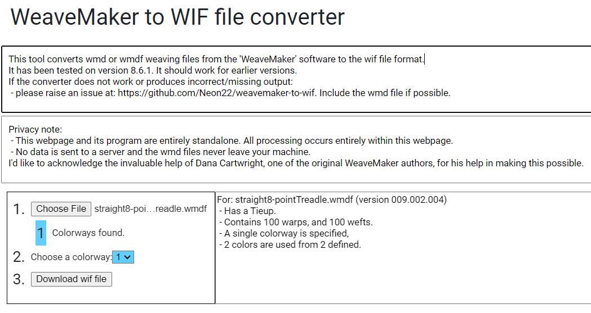

# weavemaker-to-wif
Converts WeaveMaker files to wif files.

Does so in the browser using python,pyscript,ltk.
WeaveMaker is an older program forbuilding weaving drafts. Originally designed on the Mac.
If you no longer have hardware to run the program on - you can convert old wmd/wmdf files to wif files here.

Running here:
- https://neon22.pyscriptapps.com/weavemaker-file-converter/latest/

Screenshot
